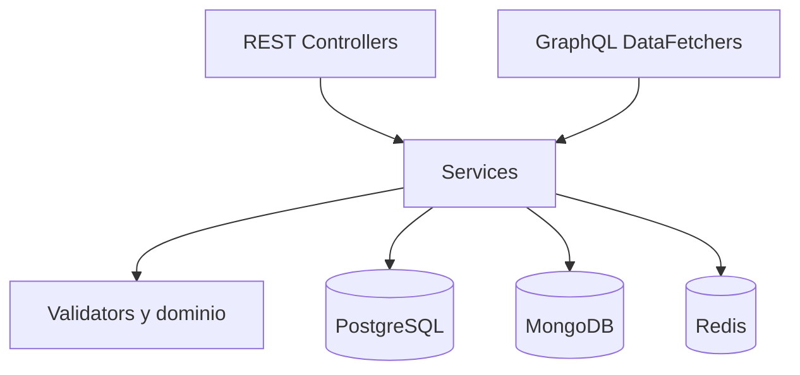

# Arquitectura

BookLibre es un backend Spring Boot organizado por capas y casos de uso.

## Capas

| Capa | Responsabilidad |
|---|---|
| `controller` | Contratos REST, autenticación y validación de entrada |
| `graphql` | Resolución de campos definidos en el schema DGS |
| `service` | Orquestación de casos de uso y límites transaccionales |
| `validator` | Reglas reutilizables de autorización y negocio |
| `domain` | Comportamiento propio de libros, usuarios y reservas |
| `repository` | Acceso a PostgreSQL, MongoDB y Redis |
| `dto` / `mapper` | Contratos externos y adaptación del dominio |

## Seguridad

Spring Security mantiene sesiones stateless. El access token identifica al usuario y sus roles. Los endpoints protegidos no aceptan un `userId` del cliente para decidir propiedad.

Las reseñas verifican que el usuario autenticado sea el lector de la reserva. Las reservas validan rol, propiedad, estado del libro y fechas.

## Concurrencia y consistencia

Antes de comprobar superposiciones, PostgreSQL toma un advisory lock transaccional derivado del identificador del libro. Así, dos instancias del backend serializan reservas concurrentes del mismo libro.

No existe una transacción distribuida entre PostgreSQL y MongoDB. PostgreSQL conserva la reserva oficial; MongoDB mantiene en el documento del libro una proyección de los rangos ocupados. Este límite debe considerarse si el sistema evoluciona hacia mayor escala.
